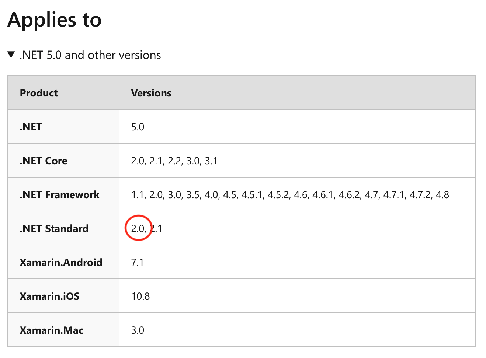

<!-- Copyright 2021 Yubico AB

Licensed under the Apache License, Version 2.0 (the "License");
you may not use this file except in compliance with the License.
You may obtain a copy of the License at

    http://www.apache.org/licenses/LICENSE-2.0

Unless required by applicable law or agreed to in writing, software
distributed under the License is distributed on an "AS IS" BASIS,
WITHOUT WARRANTIES OR CONDITIONS OF ANY KIND, either express or implied.
See the License for the specific language governing permissions and
limitations under the License. -->

# What .NET things/versions can we use?

What we think of as .NET is actually a collection of technologies. Thus, when we talk about the versions of
.NET, we are really talking about three separate things:

1. The C# language version - This dictates what language features and syntactic sugars we can leverage while
   writing code.

2. The Base Class Library (BCL) version - This dictates what .NET APIs we can call.

3. The build system / .NET SDK version - This dictates what build and project file improvements we can use
   when integrating with the `dotnet` tool, as well as static analyzers.

The specific versions discussed here apply to the SDK proper. Things like example code, demo apps, etc. can
use different / newer implementations of .NET, so long as it supports .NET Standard 2.0.

## Base Class Library (BCL)

The BCL is the standard library for .NET. It is everything that you find under the `System.*` namespaces.
**The .NET SDK project targets .NET Standard 2.0.** See the below sections for an explanation of what this
means and why we chose this.

To see whether we can use a particular API, look toward the bottom of the page for the "Applies to" section.
Note that if a method has multiple overloads, there will be multiple of these boxes. You may need to expand
the drop down (the icon next to .NET 5.0 and other versions) to see the full table.

If you see .NET Standard 2.0 listed on the table, you're good to go. If you don't, sorry, you can't use it.
[Or can you](./polyfills.md)?

### .NET Standard

When the .NET team decided to embark on building a leaner/meaner cross-platform implementation of .NET, they
decided to start small and then add to it. Additionally, there were other implementations of .NET in the wild,
namely the open-source Mono project.

Something needed to be done to track the lowest common denominator of APIs so that the various projects could
rally behind a certain set and claim support. This is the purpose of .NET Standard.

.NET Standard is a spec - NOT an implementation of .NET. It is a specification that various .NET implementations
can implement and then claim to support. This means if a particular .NET implementation claims support for
.NET Standard 1.0 or 2.1, that a certain API is guaranteed to exist.

Lastly, .NET Standard versions are strict supersets of each other. That is, they are purely additive - anything
that existed in version 1.0 will exist in 1.1, and 1.2, etc.

You can find a table that maps .NET Standard versions to actual implementations
[here](https://docs.microsoft.com/en-us/dotnet/standard/net-standard).

### Why .NET Standard 2.0?

The decision to target .NET Standard 2.0 was deliberate.

It is the last .NET Standard that is supported by the "legacy" .NET Framework implementation. .NET Framework was
the predecessor to .NET Core and is still widely used across the industry.

Since we want to reach the widest audience possible, including those with existing code bases, support for .NET
Framework is a must. This forces us to use .NET Standard 2.0. We should monitor the usage reports coming from
Microsoft and others over the next few releases to determine when it would be appropriate to drop Framework support
and move to a later standard.

## C# language

Discussing the C# language version is considerably less complex than the BCL.

### We target C# language 8.0

You can see various proposals and additions that were made to the C# language
[here](https://docs.microsoft.com/en-us/dotnet/csharp/language-reference/). We support everything in the base
specification up to and including the C# 8.0 specification proposal. Anything higher than that, we cannot yet
support.

Moving to a newer language version isn't as straightforward as it might seem at first. Some language features
actually depend on certain BCL types being present, or may work in tandem with a newer build system. Therefore,
our language version is tied, in some sense, to our version of .NET Standard.

There are some things we can do to skirt around BCL limitations by using polyfills and such, but it should not
be taken for granted. It takes a decent amount of testing to verify that polyfills are working correctly.

## Build system / SDK version - .NET 5.0.x

This project depends on analyzers only present in the .NET 5 SDK.

In order to develop .NET libraries and applications, you need to install the .NET SDK. This is automatically
done for you if you select the ".NET workload" inside of the Visual Studio installer. You can also download
the .NET SDK as a separate standalone package.

The .NET SDK is what includes all of the compilers and build tools. This includes things like the `dotnet`
CLI tool, and the MSBuild build system.

Here, it is mostly safe to keep your system up to date and install newer .NET SDK versions. This is because
all new versions of the .NET SDK should (in theory) be retaining full backward compatibility with all previous
versions. Things like the language and BCL versions are locked in separately in the project files - the SDK
is responsible for honoring those.

Updating the SDK version allows us to leverage the latest and greatest tools, like the latest static analyzers
and code refactoring tools.

SDKs can also be installed side-by-side so that you can experiment with new features while maintaining a stable
daily build environment. How to achieve this is outside the scope of this document.
